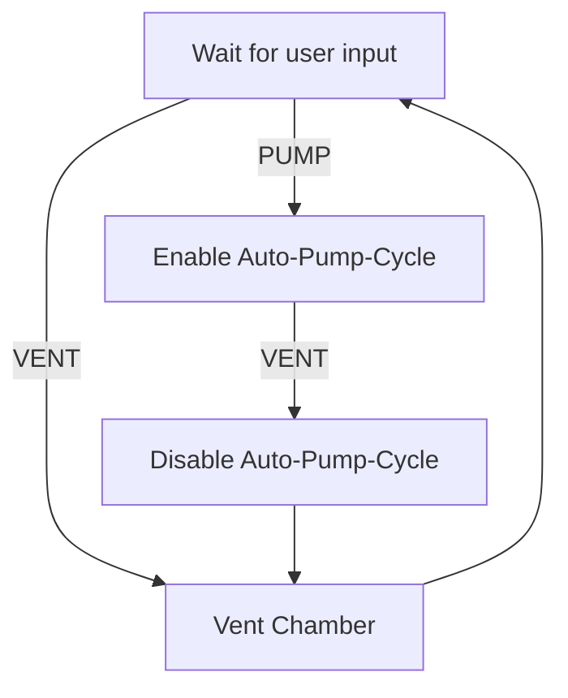

# Vacuum Holding Chamber
This is designed to keep microscope samples under vacuum until needed.

## Program Flow
When turned on, display the vacuum reading and wait for user input.

Vent: Raise the chamber to air.
\
Pump: Lower the chamber to vacuum and engage the auto-pump-cycle.

### Auto Pump Cycle
The chamber is pumped to a strong vacuum.
Over time, the vacuum slowly weakens.
Once it reaches an upper threshold, the pump will evacuate the chamber back down to a strong vacuum.
This will continue to cycle until power is lost or the user presses vent.

# Vacuum Display
The vacuum level is constantly read and displayed on a 30 LED bar graph, with LEDs 1-16 being coarse and 17-30 being fine.
Since the vacuum level reduces logarithmically, it is reduced very quickly at first then slows down as the vacuum comes closer to the scroll pump's limit.
Therefore, the coarse section has a large range per LED, and the fine section has a small range per LED to account for smaller changes.

#
This is to be used in combination with my HENRY project, for storing samples both before and after processing.
